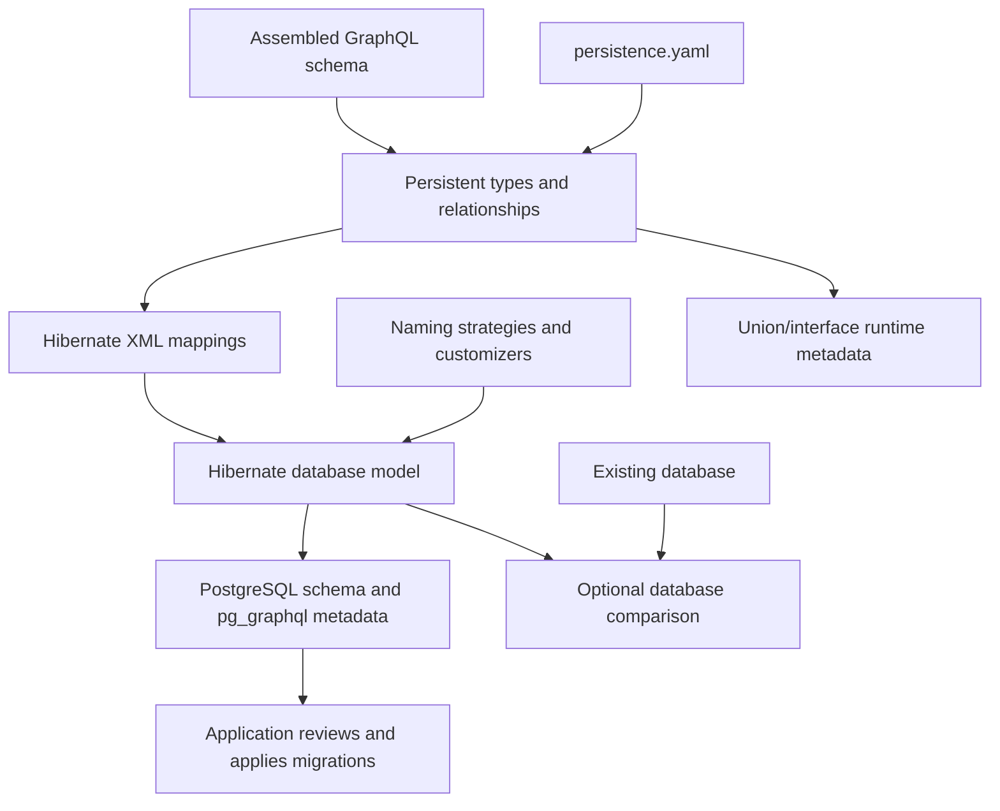
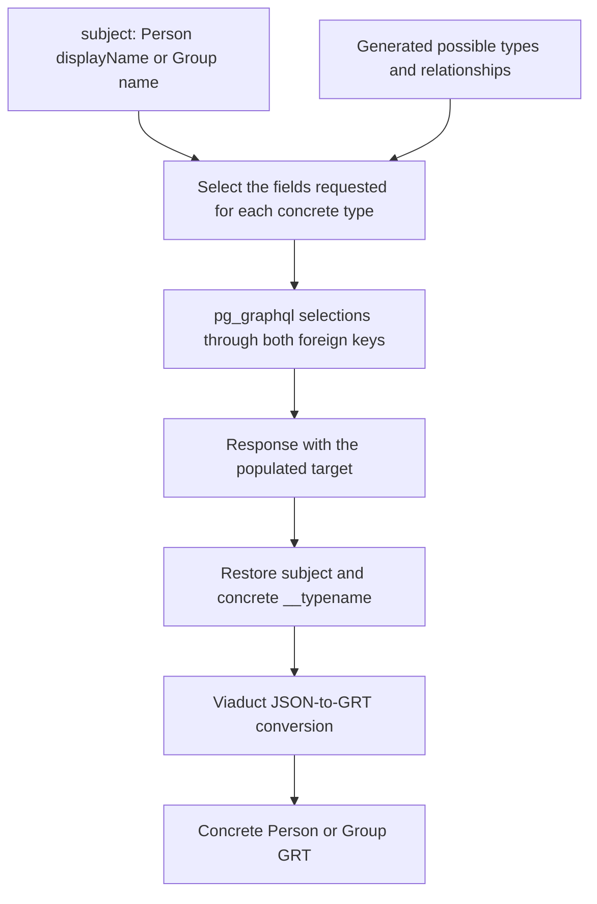
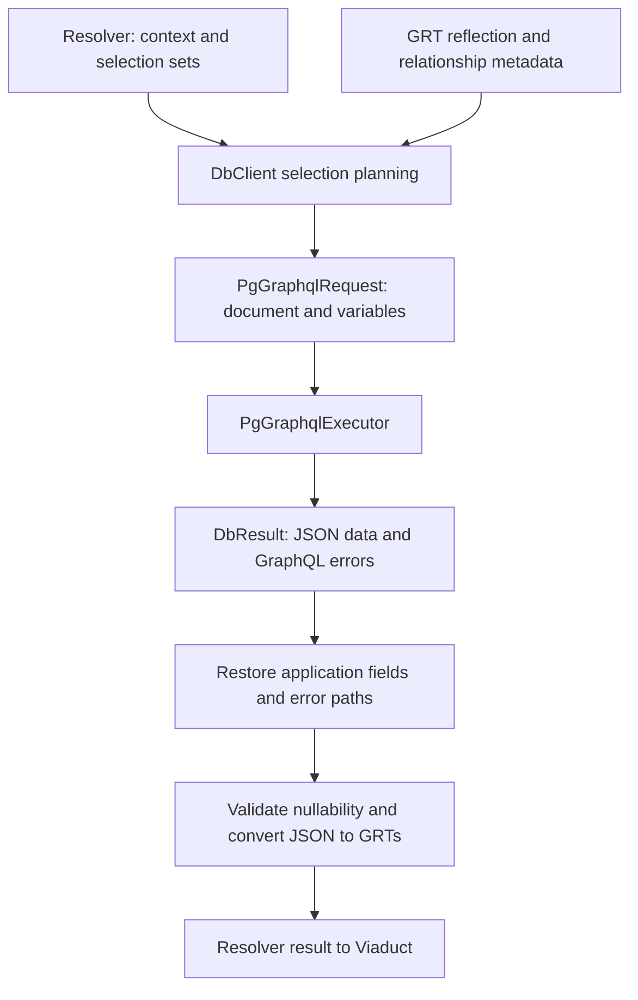
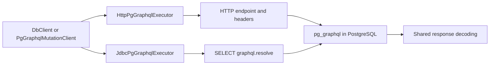
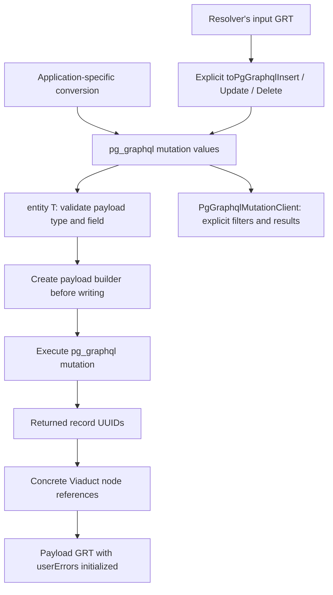
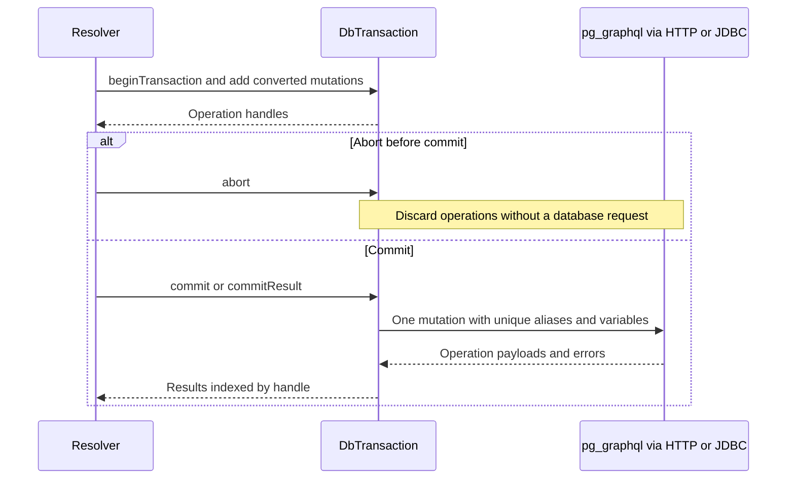
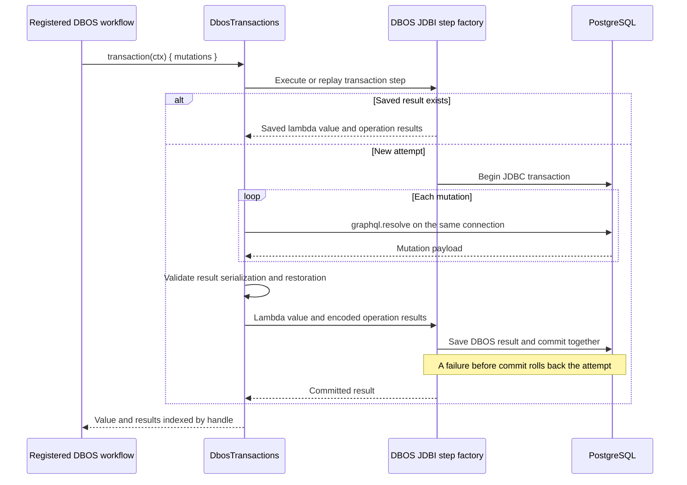
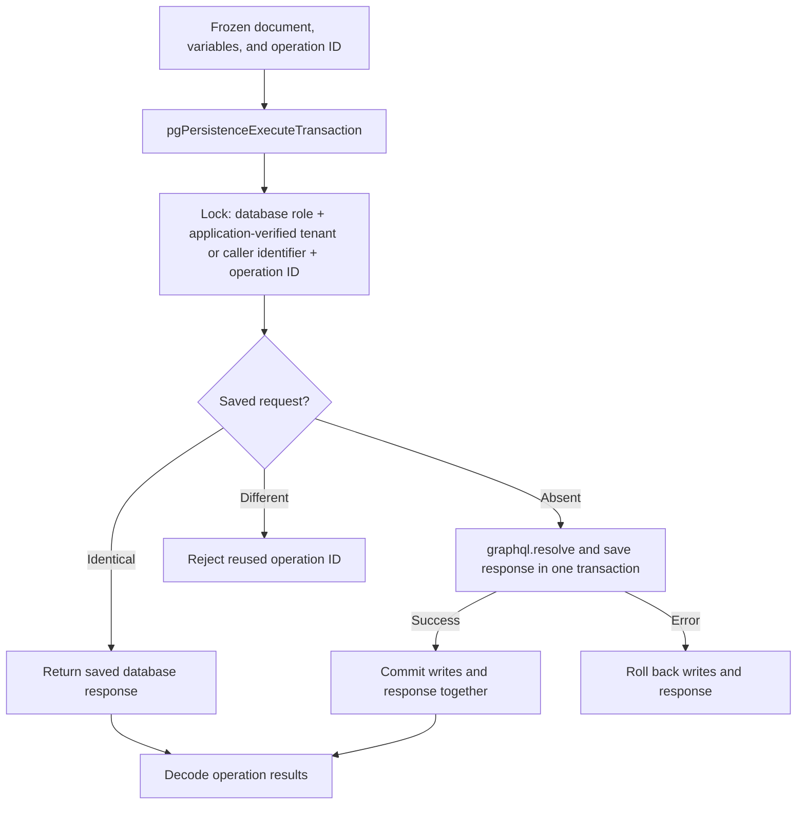

# PG Persistence Architecture

PG Persistence generates a PostgreSQL model from a Viaduct schema and connects resolvers to
`pg_graphql`. For installation and resolver examples, see [README.md](README.md).

## Components

| Module | Responsibility |
| --- | --- |
| `plugin` | Schema validation, Hibernate mappings, database files |
| `runtime` | Selection translation, mutations, GRT conversion, buffered transactions |
| `jdbc` (optional) | Execute pg_graphql through JDBC |
| `dbos` (optional) | Execute the transaction lambda in a DBOS-managed JDBC transaction |

The application owns migrations, credentials, HTTP clients or connection pools, DBOS workflows,
and authorization through Viaduct checker executors. Hibernate is used at build time, not to
execute resolver queries.

## Selective Node Resolvers

Applications declare `@resolver(isSelective: true)` on persistent nodes and implement their node
resolvers. `validateViaductPgPersistenceSchema`, required by compilation, rejects absent or
nonselective declarations after applying `denyList.types`. Batch resolvers additionally declare
`isBatching: true`; the selectivity requirement is the same.

PG Persistence does not modify Viaduct's schema-partition tasks or contribute generated resolver
declarations. Viaduct uses the application's schema to generate selective resolver bases and GRTs
and to assemble the runtime schema. Database-model generation remains independent of resolver
implementation and does not generate application code.

## Model Generation



Generation produces no Java/Kotlin entity classes and does not modify a database. Only the
optional comparison reads an existing database.

| Output | Location or purpose |
| --- | --- |
| Hibernate XML mappings and persistence-unit files | `build/generated/viaduct-persistence/` |
| Reviewed database files | `build/generated/viaduct-effective-model/META-INF/` |
| `viaduct-persistence-abstract-types.json` | Possible concrete types and stored relationships; loaded by the runtime |

Runtime metadata and GRT reflection use the owning GRT classloader. Invalid or conflicting
relationship definitions fail validation.

## Persistent Types and Relationships

Included `Node` objects get tables. Connection and edge types describe relationships, not
independent entity tables.

| Schema relationship | Database representation |
| --- | --- |
| `GroupMember.group: Group` | Foreign key on GroupMember |
| Matching `group` and `groupId: ID @idOf(type: "Group")` | One foreign-key column, exposed as both an ID and an object relationship |
| `Group.members` paired with `GroupMember.group` | Both use the GroupMember foreign key |
| Unpaired `Group.members: [GroupMember]` | Foreign key on GroupMember |
| Collections on both sides | Shared association table |
| Two collections on one type referring to the same target | Separate association tables |
| Self-reference | Separate columns for the two ends |
| Stored connection edge fields | Columns on the association row |

Association tables use the same default database schema as node tables. Concrete association
relationships use `<fieldName>Associations`; mixed union/interface collections use the public
field name. Naming and inverse-field overrides are described in
[Custom configuration](docs/CUSTOM_CONFIGURATION.md) and the
[README policy example](README.md#configure-persistence-policy).

## Unions and Interfaces

A union or interface has no table of its own. Each possible concrete `Node` retains its table.
Inherited interfaces and abstract types with only one possible concrete type use the same model.

### Database representation

For `union Subject = Person | Group`:

| Application field | Generated storage | Constraint |
| --- | --- | --- |
| `Activity.subject: Subject` | `subjectPersonId`, `subjectGroupId` on Activity | At most one target; exactly one if required |
| `Activity.subjects` list or connection | `ActivitySubjectsReference` rows with owner ID and `nodePersonId` / `nodeGroupId` | Exactly one target per row |

Each target column is a foreign key. Stored edge fields share the association row.
`semanticNotNull` makes a nullable single reference required in storage.

### From a selection set to a concrete GRT



`AbstractSelectionTranslator` composes concrete selection, relationship, and connection
translation. It expands fragments and preserves directives and aliases.
`AbstractResponseRestorer` uses field transformers to restore references, lists, connection nodes,
and type names; it also maps errors to application aliases and indexes. Internal aliases do not
escape into results.

Multiple populated targets, conflicting type names, and unknown concrete types fail rather than
being guessed. Viaduct applies response aliases and checker executors when completing the GRT.

For a read whose result type is a union or interface, `DbRead.concreteType` selects **one** table.
The runtime narrows its selection with `selectionSetFor(concreteType)`; it does not search all
possible tables.

### References, mutation payloads, and transactions

| API | Effect |
| --- | --- |
| `withReference` | Sets one concrete target ID and clears the others; null clears a nullable reference |
| `PgGraphqlAssociation.insertObject` / `withTarget` | Constructs or changes the target of a mixed collection row |
| `entity<Person>()` | Writes Person even when the application payload contains a union/interface |

Reference helpers change links, not the referenced nodes. Association writes are explicit and
can share a transaction with entity writes; their IDs must already be known.

The result type, result field, and whether it returns one node or a list are validated before
writing. Several compatible concrete payloads require `payloadType`; several compatible fields
require `entityField`. Batch payloads contain lists, but each batch writes one concrete entity type.

### Limitations and schema changes

- Every target must be an included persistent `Node`; stored `@idOf` fields need concrete targets.
- Abstract relationships on custom edge fields are unsupported. Generated names must not collide.
- Broad interfaces add one foreign key and read selection per possible target. Filters and ordering
  use generated pg_graphql fields, not a separate cross-type filter API.
- Mixed lists stop at pg_graphql's default page. Use a connection for explicit pagination.
- Changing possible types requires reviewed column/constraint changes and coordinated runtime
  metadata. Move, clear, or delete old references before removing a type; constraints alone do
  not migrate obsolete nullable references.

See [union/interface examples and integration coverage](docs/ABSTRACT_TYPES.md).

## Persistence Policy

| YAML setting | Effect |
| --- | --- |
| `denyList.types` | Excludes nodes; references from included types to excluded types fail generation |
| `semanticNotNull` | Requires stored values without changing public GraphQL nullability |
| `relationships` | Resolves inverse-field ambiguity or selects target-side foreign-key storage |

A field is non-null in persistence if its SDL is non-null, its containing type is in
`semanticNotNull.types`, or it is in `semanticNotNull.fields`. Type-level policy applies to
declared non-list fields, not recursively to related objects.

A null already explained by an upstream error keeps that error. Otherwise runtime validation
adds `SEMANTIC_NON_NULL_VIOLATION`.

## Generated Database Files

| File | Use |
| --- | --- |
| `postgresql-migration.sql` | Relational changes for application review |
| `postgresql-prerequisites.sql`, `postgresql-repeatable.sql` | PostgreSQL setup and repeatable definitions |
| `pg-graphql-metadata.sql` | Names and relationship metadata, applied after tables exist |
| `pg-graphql.sql` | Combined bootstrap for a fresh schema, not a production migration |

The database GraphQL schema may expose columns and inverse relationships absent from the
application schema. Those support persistence queries; they do not add public Viaduct fields.

## Read Execution



`ownedSelections()` is the resolver's output selection set intersected with the request's
selection set. Connection translation follows generated types, not just fields named
`nodes` or `edges`.

| Viaduct shape | pg_graphql shape |
| --- | --- |
| `nodes { id name }` | `edges { node { id name } }` |
| Stored edge fields | Selected from association rows, restored to edge GRTs |
| Node reference | Concrete `__typename` plus `uuidId` |
| Cursors and page information | Passed through unchanged |

Concrete node lists follow all provider pages; explicit connections return the requested page.
Batch node reads request any UUIDs not yet returned until all are found or the database returns
no more matches. Errors are associated with nodes separately for each response.
Separate page requests use the same credentials but are not a database snapshot.

### HTTP and JDBC transport

The shared execution interface:

```kotlin
fun interface PgGraphqlExecutor {
    suspend fun execute(
        request: PgGraphqlRequest,
        headers: Map<String, String>,
    ): DbResult<JsonObject>
}
```

`PgGraphqlRequest` holds a document, JSON variables, and an optional operation name.
`DbResult<T>` holds nullable `data` and a list of structured GraphQL errors.



| Connection | Ownership and mutation errors |
| --- | --- |
| HTTP | Preserves supplied headers and returned data/errors; partial data does not prove commit |
| JDBC `DataSource` | Owns one transaction per request; rolls back errors and discards rolled-back mutation data |
| JDBC caller-owned `Connection` | Requires autocommit off; never commits, rolls back, or closes it; mutation errors throw |

JDBC binds document, variables, and operation name to `SELECT graphql.resolve(?, ?::jsonb, ?)`.
It closes statement/result resources. HTTP authentication does not automatically apply to JDBC.
See [JDBC setup and failure handling](docs/JDBC_TRANSPORT.md).

### Partial errors

`fetchResult` and `fetchJsonResult` return both successful query data and errors from pg_graphql.
Batch node reads return a `FieldValue` per requested ID: missing rows and errors associated with
one returned edge fail only that node. Errors that cannot be associated with one returned node
are thrown. Field-level errors still fail the whole affected node until Viaduct
supports errors on individual GRT fields. The entity mutation API throws; it does not translate
upstream failures into application `userErrors`.

## Mutation Execution



Execution receives already-converted values; it does not inspect the resolver's original input.

| Rule | Behavior |
| --- | --- |
| Update/delete conversion | Select one input ID with matching `@idOf`; ambiguity requires `identifierField` |
| Selected ID | Becomes a `uuidId` filter and is removed from update values; separate arguments are not inspected |
| Omitted field / explicit null | Leave unchanged / send null |
| Nested inputs | Can be encoded, but do not create additional entity operations |
| Batch insert | One list insert for one node type |
| Batch update/delete | One operation per independently identified input |
| Payload | One compatible field, or explicit `entityField`; abstract ambiguity needs `payloadType` |
| Delete | May omit a node field; returned references contain deleted IDs, not row snapshots |

Input conversion shares the value encoder used for filters and pg_graphql values: typed IDs,
inputs, JSON, maps, collections, and scalars. No recursive writes, upsert, or additional cascading
delete behavior are provided. Database-owned constraints determine cascades.

### Buffered transactions



The lambda API manages this lifecycle automatically. No database transaction stays open while
buffering. All inputs must be known before commit; handles expose results only afterward.

Transactions cannot be empty or reused after completion. State and operation access are
synchronized. Handles include a transaction identity, preventing lookup against unrelated results.
With a caller-owned JDBC connection, calling `commit()` on a buffered transaction executes the
request but the caller still owns database commit/rollback.

## Retryable transactions

The optional execution interface keeps transaction calls independent of the implementation:

```kotlin
interface DbTransactions {
    fun <T> execute(
        headers: Map<String, String>,
        block: DbTransactionScope.() -> T,
    ): DbTransactionCommit<T>
}
```

`DbTransactionScope` exposes mutations, not commit/abort. `DbTransactionCommit<T>` contains the
lambda's value and `DbTransactionResult`, indexed by operation handles.

| Choice | Execution | How a saved transaction is identified |
| --- | --- | --- |
| Default, no `DbTransactions` | One buffered request over HTTP or JDBC | None |
| HTTP retryable transactions | Same frozen request on every attempt | Database role + application-verified tenant or caller identifier + operation ID |
| `DbosTransactions` | Immediate mutations on one DBOS-owned JDBC connection | Workflow ID + step sequence |

HTTP recovery and DBOS are separate choices; do not execute the same write through both.

### DBOS implementation



DBOS owns connection lifecycle through its JDBI step factory. The adapter uses shared mutation
generation and JDBC execution, not custom SQL or direct edits to DBOS tables.

| Concern | Contract |
| --- | --- |
| Workflow | Registered workflow required; execution stays on its thread, outside existing steps |
| Transaction block | No nested or empty transactions; its transaction object cannot be used after the block finishes or from another thread |
| Failure | A mutation failure prevents commit even if caught by application code |
| Stored value | Must be saved and restored by DBOS's configured serializer; validation occurs before commit |
| Retry | JDBC conflicts and GraphQL failures share one policy; the block may run again |
| JDBC conflicts | Retry SQLSTATE `40001` / `40P01` |
| GraphQL errors | At most three consecutive failed attempts; pg_graphql removes SQLSTATE, so permanent errors also retry |
| Retry budget | Default 30 seconds; increasing delays with random variation, capped at two seconds; running calls are not interrupted |
| Any failed attempt | Look for a saved result before retrying or recording failure; it may have committed here or on another worker. Absence does not prove rollback |
| Cleanup failure | Preserve the original error; retain cleanup/recording/lookup failures as suppressed errors |

Borrowed connections must belong exclusively to this operation. The setup hook rolls back
existing work and enables autocommit if needed so JDBI can begin its own transaction. Isolation is
set before operation SQL; JDBI closes connections, and the pool resets settings.

The adapter checks coroutine cancellation before starting and after obtaining headers, not as a
promise to undo an already-running workflow. External effects cannot be rolled back.
Standalone begin/commit/abort and HTTP prepare/resume APIs are not DBOS APIs.
See [DBOS usage, recovery, and test coverage](docs/DBOS_TRANSACTIONS.md).

### HTTP implementation without DBOS



The record table is Hibernate-mapped; its default name is
`persistence_private.transaction_records`. Generated PostgreSQL functions use the actual mapped
names. Execution uses the calling database role's permissions, preserving grants and row-level security.

| Concern | Behavior |
| --- | --- |
| Concurrent attempts | Transaction-scoped advisory lock; busy attempts retry within budget |
| Duplicate check | Separate READ COMMITTED statement after acquiring the lock; full identity is the primary key |
| Atomicity | Inner execution and response storage share an exception block; GraphQL errors also trigger rollback |
| Replay | Returns the original database response without rerunning the lambda or fetching new rows |
| Prepared request | Versioned document, variables, identity, operation count, and handle identity; no credentials or context |
| Automatic retry | Lost/malformed responses, busy lock, wrapper SQLSTATE `40001`, `40P01`, `55P03` |
| Inner GraphQL errors | Returned without guessing retryability from message text |
| Unknown outcome | Connection loss, timeout, cancellation, or missing lookup result do not prove rollback |

Advisory-lock hash collisions only add waiting; they do not change identity. A confirmed commit
remains committed if local decoding fails. Recursive execution is rejected. Zero-row updates and
deletes are successful. Automatic reversal, external effects, arbitrary SQL functions, and workflow
scheduling are outside this feature.
See [configuration, permissions, and retention](docs/CUSTOM_CONFIGURATION.md#retryable-transactions).

## Hibernate and Liquibase

Default naming pluralizes tables, converts columns to snake case, and maps internal IDs to
`_uuid_id`. Custom strategies affect mappings, generated SQL, snapshots, and diffs.

Liquibase uses `hibernate:viaduct:<path-to-descriptor.yaml>` as its reference database. The
temporary descriptor contains mapping paths, classpath, entity names, naming strategies, dialect,
and customizers. It is not an application JDBC driver or runtime ORM.
See [Custom configuration](docs/CUSTOM_CONFIGURATION.md).

## Authorization Boundary

Viaduct checker executors provide application authorization. Generated metadata enables
PostgreSQL row-level security but creates no application policies. If untrusted clients can reach
pg_graphql directly, the application must provide grants and policies. JDBC request setup must
apply verified identity explicitly; it does not inherit HTTP gateway authentication.

## Development and Publishing

Run `./gradlew check`. Publish to an isolated repository with
`./gradlew publish -PisolatedRepository=/tmp/viaduct-persistence-repository`.
Releases use in-memory PGP credentials; snapshots use Maven Central Portal credentials without signing.

### Testing retryable transactions

HTTP recovery tests use an isolated Supabase PostgreSQL database with pg_graphql
(default `kan22_retry_tests`, port 55322, password `postgres`; override `PG_RETRY_JDBC_URL`
and `PG_RETRY_PASSWORD`). They execute real `graphql.resolve` calls through JDBC and simulate HTTP
response loss, not the Supabase gateway. Never point them at application data.

```sh
./gradlew :plugin:test --tests '*RetryableTransaction*' \
  :runtime:test --tests '*RetryableTransactionTest'
```

See [DBOS tests](docs/DBOS_TRANSACTIONS.md#verification) and
[union/interface integration tests](docs/ABSTRACT_TYPES.md#running-the-approval-request-integration-tests).
