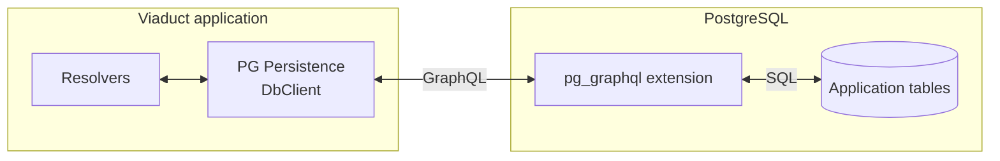

# PG Persistence

PG Persistence makes a Viaduct GraphQL schema the starting point for PostgreSQL persistence.
Wire up `DbClient` to PostgreSQL's `pg_graphql` interface, define your persistent types and
relationships in GraphQL, and delegate reads and writes from your resolvers. The library handles
the routine database mapping and data access from there.

At build time, the plugin derives tables, columns, and relationships from the schema and generates
PostgreSQL SQL and `pg_graphql` metadata. At runtime, `DbClient` turns resolver selections into
database GraphQL requests and converts results into Viaduct's generated types. Its mutation API
accepts converted Viaduct inputs and builds the declared payload from the returned node IDs.
You supply the connection configuration, apply the generated SQL through your migration process,
and write the resolver delegation, authorization, and business logic.



PG Persistence connects Viaduct resolvers to the database GraphQL API. The
`pg_graphql` extension runs inside PostgreSQL and executes queries and mutations
against application tables.

For an explanation of the generated database model and runtime behavior, see
[ARCHITECTURE.md](ARCHITECTURE.md).

## Install

Apply PG Persistence to each Viaduct module that owns database nodes. The module must already
apply the Viaduct module plugin and its Kotlin/KSP setup. For a single-project application:

```kotlin
// settings.gradle.kts
pluginManagement {
    repositories {
        maven("https://central.sonatype.com/repository/maven-snapshots/")
        gradlePluginPortal()
    }
}

dependencyResolutionManagement {
    repositories {
        maven("https://central.sonatype.com/repository/maven-snapshots/")
        mavenCentral()
    }
}
```

```kotlin
// build.gradle.kts
plugins {
    id("com.airbnb.viaduct.application-gradle-plugin") version "<viaduct-version>"
    id("com.airbnb.viaduct.module-gradle-plugin") version "<viaduct-version>"
    id("dev.viaduct.pg-persistence") version "0.1.0-SNAPSHOT"
}

dependencies {
    implementation("dev.viaduct.persistence:runtime:0.1.0-SNAPSHOT")
}
```

The runtime is a Maven dependency of the application. The snapshot repository above provides the
current `0.1.0-SNAPSHOT`; released versions are available from Maven Central.

For a multi-project application, apply PG Persistence to the database-owning modules, not just the
application project. Each module supplies its schema to the application's normal
`assembleViaductCentralSchema` task.

## Define Persistent Types

An object that implements Viaduct's `Node` interface is persistent by default. Persistence does not
require a resolver declaration or `isSelective: true`, including for types with nested nodes.

When implementing a node resolver, declare `@resolver` in your application schema. Use
`@resolver(isSelective: true)` if its output depends on the requested selections; Viaduct then
provides `ctx.selections()` and `ctx.ownedSelections()`. A resolver that always supplies its full
output can use a fixed database selection without those methods. Batch node resolvers additionally
set `isBatching: true`; batching does not require selectivity.

PG Persistence does not add resolver declarations, rewrite schema files, or generate resolver
implementations. Viaduct's normal requirement to implement declared resolvers still applies.

Object fields, lists, and connections describe relationships. These examples opt into selective
node resolution for the request-dependent `DbClient` example below:

```graphql
type Group implements Node @resolver(isSelective: true) {
  id: ID!
  name: String
  members: [GroupMember]
}

type GroupMember implements Node @resolver(isSelective: true) {
  id: ID!
  group: Group
  person: Person
}

type Person implements Node @resolver(isSelective: true) {
  id: ID!
  displayName: String
}
```

An `ID` field with `@idOf` stores a reference without requiring an object field:

```graphql
type Person implements Node @resolver(isSelective: true) {
  id: ID!
  groupId: ID @idOf(type: "Group")
}
```

The scalar ID field may also accompany a matching object field. These fields use the same foreign
key column:

```graphql
type Person implements Node @resolver(isSelective: true) {
  id: ID!
  group: Group
  groupId: ID @idOf(type: "Group")
}
```

The `@idOf` target must match the object field's type.

Supported stored fields are:

| GraphQL field | PostgreSQL representation |
| --- | --- |
| `ID` | UUID |
| `String` | Text |
| `Date` | Date |
| `DateTime` | Timestamp with time zone |
| `Time` | Time |
| `Boolean` | Boolean |
| `Byte`, `Short`, `Int`, `Long` | Matching integer type |
| `Float` | Double precision |
| `BigDecimal`, `BigInteger` | Numeric |
| `JSON` | JSONB |
| Enum | Text |
| Persistent object, list, or connection | Relationship |
| Union or interface of persistent nodes | Reference to one concrete node; lists and connections may mix types |

List fields are supported only when their elements are persistent `Node` types. Nested lists and
lists of scalar, enum, or arbitrary non-persistent object values are not supported. Resolver-backed
fields that are not relationships between persistent types are not stored.

Concrete node-list relationships follow pg_graphql cursors to load all accessible references.
This can require multiple requests and is not a database snapshot across pages. Prefer a connection
for large collections: connections return only the requested page, with cursors for the next request.

Unions and interfaces are supported in reads, mutation payloads, and stored relationships.
Every concrete target of a stored relationship must be an included persistent `Node`.
See [Using unions and interfaces](docs/ABSTRACT_TYPES.md) for selection, mutation, and mixed
collection examples.

## SQL functions

Use the library's `PgGraphqlClient` for application-owned SQL functions exposed by pg_graphql.
For a function returning JSON or JSONB, `executeJson` decodes pg_graphql's string-encoded JSON
result with a Kotlin serializer. It also handles request-variable encoding:

```kotlin
import dev.viaduct.persistence.runtime.db.executeJson

val users = client.executeJson(
    document = "query { getAllUsersJson }",
    responseKey = "getAllUsersJson",
    deserializer = ListSerializer(UserRecord.serializer()),
    headers = authenticatedHeaders,
)
```

For other GraphQL return types, use `execute`. Its `PgGraphqlObject` overload accepts ordinary
field values as variables. SQL-function definitions and their authorization checks belong to the
application; no HTTP transport or JSON-envelope handling needs to be copied into it.

## Configure Persistence Policy

Optional persistence policy belongs in `src/main/viaduct/persistence.yaml`:

```yaml
denyList:
  types:
    - ExternalProfile

semanticNotNull:
  types:
    - Group
  fields:
    - Person.displayName

relationships:
  unidirectionalTargetForeignKeyFields:
    - Group.members
  inverseFieldOverrides:
    ExternalGroup.discordServerRoles: server
```

- `denyList.types` excludes an occasional `Node`. For a large externally backed schema, use a
  separate Viaduct tenant module without this plugin.
- `semanticNotNull` requires stored values while leaving public GraphQL field nullability intact.
- `relationships.unidirectionalTargetForeignKeyFields` names collection fields that store the
  relationship as a foreign key on the contained node's table. Each value uses `Type.field`, must
  identify a persistent collection, and cannot be used when the connection has stored edge fields.
- `relationships.inverseFieldOverrides` resolves a collection whose contained node type has more
  than one object field referring back to the collection's declaring type. The key is the
  collection's `Type.field`; the value is the exact object-field name on the contained type. The
  named field must exist and refer to the declaring type.

For example, if `DiscordServerRoleGroup` has both `externalGroup: ExternalGroup` and
`server: ExternalGroup`, the schema alone cannot determine which field stores
`ExternalGroup.discordServerRoles`. This entry selects `server`:

```yaml
relationships:
  inverseFieldOverrides:
    ExternalGroup.discordServerRoles: server
```

Unknown keys, types, field coordinates, and ineffective entries fail generation. Override only
the file location from Gradle when needed:

```kotlin
viaductPgPersistence {
    persistenceConfigFile.set(layout.projectDirectory.file("config/persistence.yaml"))
}
```

## Generate and Apply Database Changes

```bash
./gradlew buildViaductEffectiveModel
```

Review the files under:

```text
build/generated/viaduct-effective-model/META-INF/
  postgresql-migration.sql
  postgresql-prerequisites.sql
  postgresql-repeatable.sql
  pg-graphql-metadata.sql
  pg-graphql.sql
```

Adapt `postgresql-migration.sql` into the application's migration system. Apply
`pg-graphql-metadata.sql` after the relational schema exists. `pg-graphql.sql` is a convenience
bundle for a fresh schema, not a repeatable production migration. The plugin never applies
database changes automatically.

### Compare with an Existing Database

```kotlin
viaductPgPersistence {
    schemaDiffUrl.set(providers.environmentVariable("SCHEMA_DIFF_DATABASE_URL"))
    schemaDiffUser.set(providers.environmentVariable("SCHEMA_DIFF_DATABASE_USER"))
    schemaDiffPassword.set(providers.environmentVariable("SCHEMA_DIFF_DATABASE_PASSWORD"))
}
```

```bash
./gradlew hibernateSchemaDiff
```

Review `build/schema-diff/hibernate-review.postgresql.sql` and
`build/schema-diff/hibernate-destructive-review.postgresql.sql`. Renames, removals, data
backfills, and database-owned constraints remain manual migration work.

## Configure `DbClient`

```kotlin
val dbClient = DbClient(
    httpClient = httpClient,
    endpoint = postgresGraphqlEndpoint,
    requestHeaders = DbRequestHeaders { context ->
        mapOf("Authorization" to "Bearer ${accessTokenFor(context)}")
    },
)
```

The endpoint and headers depend on the service exposing `pg_graphql`. Supabase normally uses
`https://<project>.supabase.co/graphql/v1` and expects both `Authorization` and `apikey` headers.

## Resolve Persistent Nodes

For the `Group` type above, add this mutation to `src/main/viaduct/schema/Group.graphqls`:

```graphql
input AddGroupInput {
  name: String!
}

type AddGroupPayload {
  group: Group
}

extend type Mutation {
  addGroup(input: AddGroupInput!): AddGroupPayload @resolver
}
```

Here is the complete `src/main/kotlin/com/example/groups/GroupResolvers.kt` file for a module
whose configured package is `com.example.groups`, using the default `viaduct.api.grts` package.
The application's resolver factory supplies the configured `DbClient` to both constructors.

```kotlin
package com.example.groups

import com.example.groups.resolverbases.MutationResolvers
import com.example.groups.resolverbases.NodeResolvers
import dev.viaduct.persistence.runtime.db.DbClient
import dev.viaduct.persistence.runtime.db.toPgGraphqlInsert
import viaduct.api.grts.AddGroupPayload
import viaduct.api.grts.Group
import viaduct.api.resolver.Resolver

@Resolver
class GroupNodeResolver(
    private val dbClient: DbClient,
) : NodeResolvers.Group() {
    override suspend fun resolve(ctx: Context): Group =
        dbClient.fetchByInternalId(
            ctx = ctx,
            collectionField = "groupCollection",
            id = ctx.id.internalID,
            ownedSelections = ctx.ownedSelections(),
            requestedSelections = ctx.selections(),
        )
}

@Resolver
class AddGroupResolver(
    private val dbClient: DbClient,
) : MutationResolvers.AddGroup() {
    override suspend fun resolve(ctx: Context): AddGroupPayload {
        val insert = ctx.arguments.input.toPgGraphqlInsert()
        return dbClient.entity<Group>().insert(ctx, insert)
    }
}
```

The mutation inserts the input and builds a payload containing a reference to the new group.
Selecting the group's fields invokes `GroupNodeResolver`, which fetches the requested data.
`NodeResolvers`, `MutationResolvers`, and the result types are generated from the schema.

`ownedSelections()` is the resolver's output selection set intersected with the current request's
selection set.

Other common operations are:

- `fetch` for an explicit `DbRead`.
- `fetchResult` for a `DbResult` containing a GRT and any GraphQL errors returned by pg_graphql.
- `fetchJsonResult` for the equivalent JSON result.
- `fetchNode` when returned node references must be attached.
- `fetchUuidIds` for a collection resolver that returns node references.
- `fetchUuidConnection` for `first`/`after` or `last`/`before` pagination.
- `fetchNestedUuidConnections` for the same child connection across several parents.

Pass cursor strings returned by pg_graphql back unchanged. Applications must not decode or
construct them.

### Return Batch Node Results

For a batch node resolver, `fetchByInternalIdsResult` returns one Viaduct `FieldValue` per
requested UUID:

```kotlin
val byId = dbClient.fetchByInternalIdsResult(
    ctx = contexts.first(),
    collectionField = "groupCollection",
    ids = contexts.map { it.id.internalID },
    ownedSelections = contexts.first().ownedSelections(),
    requestedSelections = contexts.first().selections(),
)
return contexts.associateWith { context -> byId.getValue(context.id.internalID) }
```

Found nodes remain successful when another UUID is absent. A missing row becomes an error value
with code `MISSING_ROW`, and a pg_graphql error associated with one returned edge becomes an error
value for that node. Viaduct uses the original resolver context to place the error at the
application GraphQL response path. Errors that cannot be associated with an edge are thrown rather
than discarded. Until Viaduct provides a supported way to put an error value on an individual GRT
field, a field error fails its node while preserving the other nodes in the batch.

## Resolve Mutations

Convert the Viaduct input into a pg_graphql value, then pass that value to the selected persistent
node type. The resolver context supplies the payload type:

```kotlin
override suspend fun resolve(ctx: Context): AddGroupMemberPayload {
    val insert = ctx.arguments.input.toPgGraphqlInsert()
    return dbClient.entity<GroupMember>().insert(ctx, insert)
}
```

The same API supports updates, deletes, and batches:

```kotlin
dbClient.entity<Group>().update(ctx, ctx.arguments.input.toPgGraphqlUpdate<Group>())
dbClient.entity<GroupMember>().delete(ctx, ctx.arguments.input.toPgGraphqlDelete<GroupMember>())

dbClient.entity<GroupMember>().insertBatch(ctx, ctx.arguments.inputs.map { it.toPgGraphqlInsert() })
dbClient.entity<GroupMember>().updateBatch(ctx, ctx.arguments.inputs.map { it.toPgGraphqlUpdate<GroupMember>() })
dbClient.entity<GroupMember>().deleteBatch(ctx, ctx.arguments.inputs.map { it.toPgGraphqlDelete<GroupMember>() })
```

The conversion functions convert typed global IDs. The client creates returned node references, fills the matching payload
field, and initializes `userErrors` to an empty list. A payload field may be a union or interface
that includes the selected node type. Resolve multiple compatible fields with `entityField`;
resolve multiple compatible concrete payload types with `payloadType`. These are optional
arguments, validated before writing. See [abstract mutation payloads](docs/ABSTRACT_TYPES.md#mutation-payloads).

### Mutation limitations

The entity API provides pg_graphql insert, update, and delete operations for one persistent node
type at a time. Each call writes only the table represented by `entity<T>()`. It does not inspect an
input object for other persistent node types and does not turn nested objects into additional
database operations.

For example, an `insert<Group>` can write the Group's scalar fields and foreign-key ID fields. An
input shaped like this does not also insert the people:

```graphql
input AddGroupInput {
  name: String!
  members: [AddPersonInput!]
}
```

pg_graphql's `GroupInsertInput` has no nested insert operation for `members`, so passing that field
causes a pg_graphql input error. To refer to an existing node, pass the corresponding typed ID field:

```graphql
input AddGroupMemberInput {
  groupId: ID! @idOf(type: "Group")
  personId: ID! @idOf(type: "Person")
}
```

To create the Group, Person, and GroupMember together, the resolver performs three inserts and
passes client-created UUIDs into GroupMember. A transaction sends those inserts in one request.

### Buffer mutations in one transaction

Begin a transaction to buffer several mutation operations. Nothing is sent to pg_graphql until
commit; abort discards the buffered operations without sending a request.

For example, a mutation returning `Boolean!` can accept an input containing generated `group` and
`membership` input objects. Each input supplies a client-created `uuidId`, and
`membership.groupId` references `group.uuidId`. Convert those Viaduct inputs separately, then
insert both in one transaction:

```kotlin
override suspend fun resolve(ctx: Context): Boolean {
    val input = ctx.arguments.input
    val group = input.group.toPgGraphqlInsert()
    val membership = input.membership.toPgGraphqlInsert()

    dbClient.transaction(ctx) {
        entity<Group>().insert(group)
        entity<GroupMember>().insert(membership)
    }

    return true
}
```

`toPgGraphqlInsert()` converts generated Viaduct input GRTs, not output objects constructed with
`Group.Builder`. Each converted input must contain fields accepted by its table's pg_graphql insert
input, including `membership.personId` for the existing person. Typed ID fields use `@idOf`.

`transaction(ctx) { ... }` commits after the block succeeds and aborts if the block throws. A commit
error throws, so the resolver returns `true` only after a successful commit. Use
`beginTransaction(ctx)` directly when application code needs to call `commitResult()` or abort
without throwing. The lambda returns an application-selected value alongside the database results,
so it can return one operation handle or a collection of handles for use after commit. Lifecycle
methods are not available inside the lambda.

Convert Viaduct inputs before adding them. Each operation returns a handle because its database
result does not exist until commit. `commitResult()` preserves partial data and GraphQL errors.
All values must be known before commit, so operations cannot use or branch on an earlier result.

Batch operations do not change this rule. `insertBatch<Group>` inserts several Groups in one table;
it does not insert a mixed object graph. Batch update and delete likewise target one selected node
type.

An update sends only fields present in the Viaduct input after removing its selected identifier.
An omitted field is not changed; an explicitly supplied null is sent as null. Delete removes only
the selected rows. Any cascading delete behavior comes from application-owned database constraints,
not recursive behavior in PG Persistence. The entity API does not provide upsert.

Insert conversion accepts a generated Viaduct input whose supplied fields are valid for pg_graphql's
insert input for the selected node. Update and delete conversion require that input to contain an ID field whose
`@idOf` target is the type selected by `entity<T>()`. The ID must be inside the input;
the entity API does not inspect a separate mutation argument. The client converts that GlobalID to
the row's `uuidId` filter and excludes the selected field from the values sent by update.

The client automatically uses the matching `@idOf` field when exactly one exists. No match fails
because the operation cannot identify a row. If more than one field matches, the operation fails
rather than guessing; select the identifying field explicitly:

```kotlin
val update = ctx.arguments.input.toPgGraphqlUpdate<Group>(identifierField = "groupId")
dbClient.entity<Group>().update(ctx, update)
```

The explicit field must exist in the input and have `@idOf(type: "Group")`. Batch update and delete
use the same identifier field for every input. They execute one pg_graphql operation per input;
batch insert sends all inputs in one operation.

Insert and update payloads must identify one compatible node field, unambiguously or with `entityField`. Delete
payloads may omit that field. When present, delete payloads contain references with the deleted
IDs, not snapshots of the deleted rows; other fields cannot be fetched from those rows afterward.
The entity API initializes `userErrors` to an empty list but does not
convert pg_graphql errors into application `userErrors`; operations throw on those errors. Use the
lower-level `PgGraphqlMutationClient` for explicit filters, returned database records, partial data,
or structured pg_graphql errors.

Use `PgGraphqlMutationClient` directly when a resolver needs the records returned by pg_graphql
instead of having `DbClient.entity<T>()` build the resolver's mutation payload.

### Use `PgGraphqlMutationClient` directly

The lower-level client executes pg_graphql collection mutations without building a Viaduct payload:

```kotlin
val mutations = PgGraphqlMutationClient(httpClient, postgresGraphqlEndpoint)
val group = PgGraphqlEntity("Group")

val inserted = mutations.insert(
    entity = group,
    objectValue = ctx.arguments.input.toPgGraphqlInsert(),
    selection = "affectedCount records { uuidId name }",
    headers = mapOf("Authorization" to "Bearer $accessToken"),
)
```

This lower-level client accepts pg_graphql JSON. Convert a Viaduct input separately or construct
the pg_graphql values directly. Typed GlobalIDs are converted by `toPgGraphqlInsert`.

Update and delete accept explicit pg_graphql filters. `atMost` is required, must be greater than
zero, and limits how many matching rows pg_graphql may change:

```kotlin
val filter = buildJsonObject {
    put("uuidId", buildJsonObject { put("eq", groupId.internalID) })
}

val updated = mutations.update(
    entity = group,
    set = buildJsonObject { put("name", "New name") },
    filter = filter,
    atMost = 1,
    selection = "affectedCount records { uuidId name }",
    headers = requestHeaders,
)

val deleted = mutations.delete(
    entity = group,
    filter = filter,
    atMost = 1,
    headers = requestHeaders,
)
```

The `selection` is the selection inside the pg_graphql mutation payload; its default is
`affectedCount`. Methods without `Result` throw `UpstreamGraphqlException` when pg_graphql returns
errors. Use `insertResult`, `updateResult`, or `deleteResult` to receive a `DbResult` containing
partial payload data and structured GraphQL errors. Headers are supplied per call; unlike
`DbClient`, this client does not derive them from an execution context.

### Retry a transaction safely

After [enabling retryable transactions](docs/CUSTOM_CONFIGURATION.md#retryable-transactions),
give the transaction a stable operation ID. Using the generated inputs from the transaction
example above:

```kotlin
val input = ctx.arguments.input
val group = input.group.toPgGraphqlInsert()
val membership = input.membership.toPgGraphqlInsert()

dbClient.transaction(ctx, operationId = requestId) {
    entity<Group>().insert(group)
    entity<GroupMember>().insert(membership)
}
```

`requestId` is an application-supplied identifier for this logical operation, reused on retries.
The library retries the frozen database request, not the lambda or resolver. A repeated operation
returns its saved database result. Reusing the ID with different commands fails. Keep UUIDs and
other input values unchanged.

To save a request before sending it, use `beginTransaction(ctx, operationId)`, add operations,
then call `prepare().encode()`. Store that string in trusted durable storage. Resume it with
`dbClient.resumeTransaction(ctx, DbPreparedTransaction.decode(saved))`; this uses fresh request
headers and checks that the trusted scope still matches.

`lookupTransaction(ctx, operationId)` returns the saved request and result, or null if no committed
record is visible. Null does **not** prove rollback: an earlier request may still be running.
`DbTransactionException.outcome` distinguishes an unknown outcome from a confirmed commit whose
result could not be decoded. Preserve its `prepared` request when recovering; do not generate a new ID.
Cancellation also does not prove rollback. Prepare and persist first if recovery after cancellation
or process exit is required.

See [transaction implementation details](ARCHITECTURE.md#retryable-transactions)
for concurrency, permissions, and retention limitations.

## Gradle Tasks

| Task | Use |
| --- | --- |
| `validateViaductPgPersistenceSchema` | Validate schema and policy compatibility |
| `generateViaductPgPersistenceModel` | Generate persistence metadata |
| `buildViaductEffectiveModel` | Generate PostgreSQL and pg_graphql SQL |
| `hibernateSchemaSnapshot` | Write a database-model snapshot |
| `hibernateSchemaDiff` | Compare the generated model with PostgreSQL |

## Custom Configuration

Most applications should use the generated defaults. For custom naming strategies, Hibernate
metadata customization, schema-directory changes, or complete HBM replacement, see
[Custom configuration](docs/CUSTOM_CONFIGURATION.md).

## Requirements

- A Gradle build that provides `assembleViaductCentralSchema`
- PostgreSQL when applying generated SQL
- `pgcrypto` and `pg_graphql` for the complete PostgreSQL/GraphQL integration

Applications do not need to be implemented in Kotlin or run on the JVM to use the generated
PostgreSQL schema and pg_graphql API. The Gradle plugin and Viaduct runtime integration are JVM
tools, but that is not a requirement of the database interface.

## License

PG Persistence is licensed under the [Apache License, Version 2.0](LICENSE).
